# Architecture

This document explains how OpenAPI Studio AI is put together and — more usefully — _why_. If you are
about to add a feature, read the layering rules first: most review comments on this project are about
which layer a change belongs in.

## Layers

```mermaid
flowchart LR
    subgraph L1["1 · Core engines — src/lib/core"]
        direction TB
        C1["openapi/ — parse, validate, lint, deref, diff, examples"]
        C2["security/ — OWASP rule engine"]
        C3["mock/ — matcher + response engine"]
        C4["sdk/ — IR + 7 emitters"]
        C5["testing/ — interpolate, assertions, runner"]
        C6["ai/ — prompts, offline engine, autofix, extraction"]
        C7["telemetry/ — metric aggregation"]
        C8["graphql/ — SDL reader"]
    end

    subgraph L2["2 · Server — src/lib/server, src/lib/repository, src/lib/services"]
        S1["env · logger · crypto · rate-limit · ssrf · http"]
        S2["StudioRepository port"]
        S3["SpecService"]
    end

    subgraph L3["3 · Delivery — src/app"]
        D1["API routes"]
        D2["Server components"]
        D3["Client components"]
    end

    L1 --> L2 --> L3
    L1 --> L3
```



**Dependencies point one way.** Core never imports from `server` or `app`. `server` never imports from
`app`. A client component may import a core engine (they are pure and bundle cleanly) but never a
server module.

## 1 · Core engines

Everything under `src/lib/core` is a pure function or a class over plain data. No `fetch`, no `fs`, no
`process.env`, no React. This is not aesthetic preference — it is what makes the analysis of a 57 KB
specification take single-digit milliseconds and the whole 205-test suite run in under three seconds.

### `openapi/`

| Module        | Responsibility                                                                                                                                                       |
| ------------- | -------------------------------------------------------------------------------------------------------------------------------------------------------------------- |
| `types.ts`    | Permissive structural types for 3.0/3.1. Deliberately loose: a design tool must load partially-invalid documents rather than refuse them.                            |
| `document.ts` | Format detection, parsing with source positions, serialisation, YAML↔JSON conversion.                                                                                |
| `pointer.ts`  | RFC 6901 pointers — the addressing scheme every diagnostic, comment and diff entry uses.                                                                             |
| `deref.ts`    | Local `$ref` resolution with cycle detection. **External refs are never fetched** — a validator that performs network requests on untrusted input is an SSRF vector. |
| `navigate.ts` | `listOperations()`: the single flattening of paths + webhooks into operations, with path- and operation-level parameters merged.                                     |
| `validate.ts` | Structural validation. Hand-written, not JSON-Schema meta-validation, so every message is written for a human and carries a pointer and often a fix.                 |
| `lint.ts`     | Quality rules: documentation coverage, examples, error modelling, pagination, naming, dead components.                                                               |
| `examples.ts` | Deterministic example generation (seeded mulberry32). Determinism matters: mock, docs and SDK examples must agree, and snapshots must not churn.                     |
| `diff.ts`     | Semantic diff and breaking-change classification.                                                                                                                    |

### Why the diff engine knows about direction

A schema change breaks a different party depending on where it appears:

| Change                   | In a response                       | In a request                     |
| ------------------------ | ----------------------------------- | -------------------------------- |
| Property removed         | **breaking** (readers lose a field) | breaking only if it was required |
| Property added           | additive                            | **breaking** if required         |
| Enum value added         | **breaking** (exhaustive consumers) | additive                         |
| Property became required | additive                            | **breaking**                     |

`diffSchema()` therefore takes a `direction` parameter. This is the difference between a diff that is
useful in review and one that cries wolf.

### `sdk/`

`model.ts` builds a language-neutral IR (`SdkSpec`) from the document: models, operations, parameters,
auth, pagination style. Each emitter consumes the IR. Adding a language means writing one emitter — not
re-implementing OpenAPI traversal, naming rules or pagination detection.

### `ai/`

The assistant has two engines behind one interface:

- **`openrouter.ts`** streams from a hosted model, then `extract.ts` strips markdown fences and prose,
  parses, and validates. Structural errors trigger one repair round-trip.
- **`offline.ts` + `blueprint.ts`** encode API design expertise as _data_ — resource models, error
  contracts, pagination, idempotency, rate limits, webhook signing — and assemble a complete OpenAPI
  3.1 document with no network access.

The offline engine is not a stub: it scores 92+ on the platform's own quality analysis and grade A on
its own security analysis. It exists because "works with zero API keys" is a product requirement, not
a fallback nobody tests.

## 2 · Server layer

### Persistence is a port

```ts
export interface StudioRepository {
  readonly kind: "memory" | "file" | "postgres";
  getProject(id: string): Promise<ApiProject | null>;
  // …
}
```

Three implementations: `MemoryRepository` (tests), `FileRepository` (default — an atomically written
JSON snapshot), `PostgresRepository` (Supabase-compatible, migrates on boot).

**A subtlety worth knowing:** Next.js compiles route handlers and server components into _separate_
server bundles, so a module-level singleton is not shared between them. `FileRepository` therefore
checks the snapshot's mtime before every read and reloads when another bundle has written. Without
that, a spec created through `/api/specs` is invisible to the page that renders it. Writes are awaited
rather than debounced for the same reason — a read-after-write race is not worth a millisecond.

### One HTTP seam

Every route is wrapped in `route()` from `src/lib/server/http.ts`, which provides identity resolution,
rate limiting, structured logging with credential redaction, and uniform error mapping (`ApiError`,
`ZodError`, `NotFoundError`, `ForbiddenError` → the right status and body). Behaviour cannot drift
between endpoints because there is only one implementation of it.

### Security controls

| Control                | Where                  | Notes                                                                                                                                                                                            |
| ---------------------- | ---------------------- | ------------------------------------------------------------------------------------------------------------------------------------------------------------------------------------------------ |
| SSRF policy            | `server/ssrf.ts`       | The API client proxies user-supplied requests, so every target is checked against private/loopback/link-local ranges and an allowed-protocol list; hop-by-hop and identity headers are stripped. |
| Rate limiting          | `server/rate-limit.ts` | In-process fixed window, per identity or IP, per scope. The `consume()` signature is the seam for a Redis backend.                                                                               |
| Secret encryption      | `server/crypto.ts`     | AES-256-GCM for stored environment variables. Secrets are returned to the browser masked, never in plaintext.                                                                                    |
| Environment validation | `server/env.ts`        | Zod-validated, everything optional. `APP_MODE=production` adds a readiness check the health endpoint reports on.                                                                                 |
| Log redaction          | `server/logger.ts`     | Any key matching `authorization                                                                                                                                                                  | cookie | api[-_]?key | secret | token | password` is redacted at any depth. |

## 3 · Delivery

- **API routes** are thin: parse input with Zod, call a service or a core engine, render the response.
- **Server components** fetch through `SpecService` and pass plain data down.
- **Client components** own interaction. The designer keeps the document _source string_ as the single
  source of truth: the visual editor mutates a structural clone and hands back re-serialised source, so
  the two views cannot diverge.

## Testing strategy

| Layer                  | How it is tested                                                                                                  |
| ---------------------- | ----------------------------------------------------------------------------------------------------------------- |
| Core engines           | Direct unit tests with fixture documents. No mocks needed — they are pure.                                        |
| Services + repository  | Integration tests against `MemoryRepository`, exercising the real lifecycle (create → version → diff → rollback). |
| Cross-engine behaviour | An integration test runs an imported collection through the mock engine and asserts the resulting telemetry.      |
| Delivery               | Playwright covers the landing page, designer, docs, security, mock, SDK, versions, client and monitoring screens. |

The runner is injected into `runCollection()` as a `Transport`, which is why the collection runner is
tested without a network and why the same code path serves both ad-hoc requests and suite runs.

## Adding a feature

1. **Is it a pure transformation of a document?** It belongs in `src/lib/core`, with unit tests.
2. **Does it need storage?** Add it to the `StudioRepository` interface and implement it in all three
   backends.
3. **Does it need an endpoint?** Add a route that validates with Zod and delegates. Keep logic out of it.
4. **Does it need UI?** Server component for data, client component for interaction.
5. **Run `pnpm verify`.** Typecheck, lint, tests and build must all pass.
