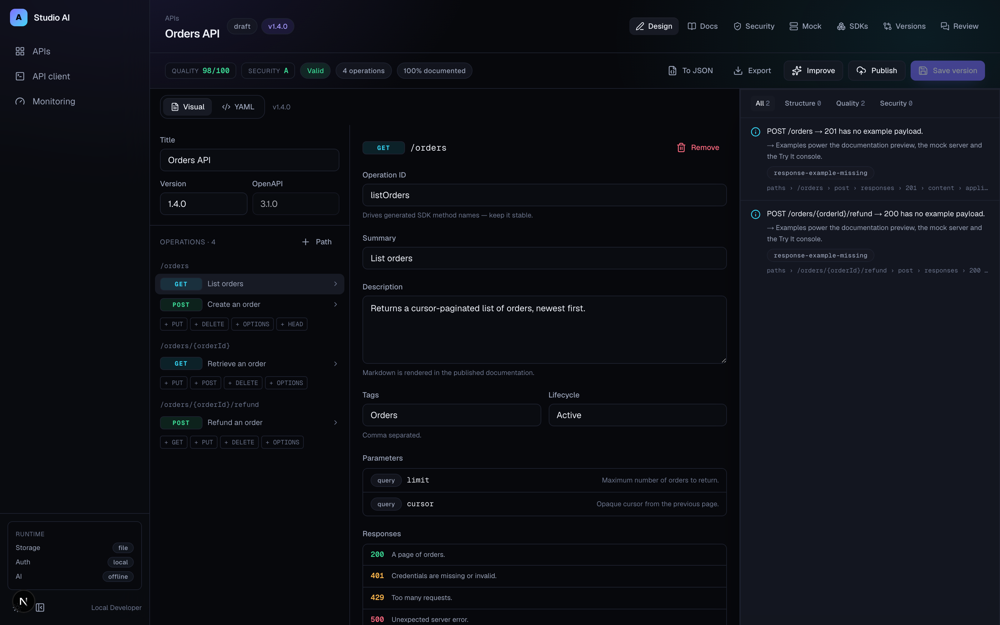
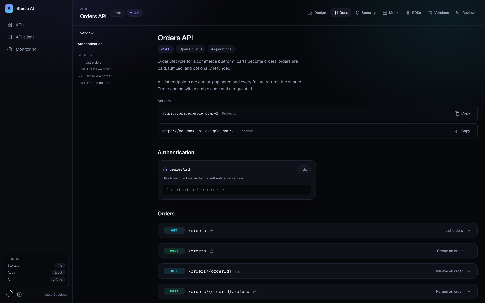
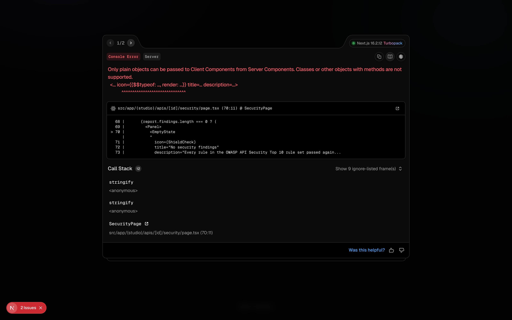
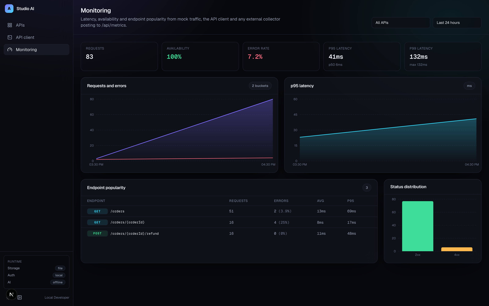
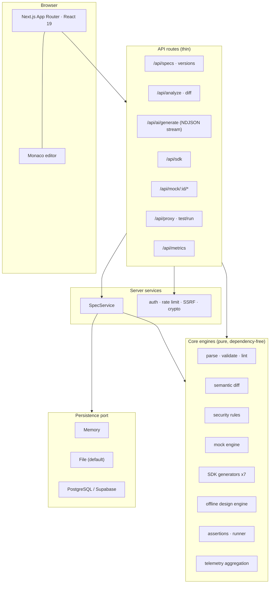

<div align="center">

# OpenAPI Studio AI

**Design, validate, mock, test, document and monitor APIs — from one open-source application.**

[](https://github.com/itsshreyasbhardwaj-design/openapi-studio-ai/actions/workflows/ci.yml)
[](./LICENSE)
[](https://spec.openapis.org/oas/latest.html)
[](#testing)

</div>

---

OpenAPI Studio AI is an API engineering platform, not a specification viewer. It takes a contract from
a sentence of English to a validated, secured, mocked, tested, documented, versioned artefact with SDKs
in seven languages — and every subsystem is a real engine with its own test suite, sharing one document
model so they can never disagree about your API.

**It runs completely free.** With an empty `.env` the AI assistant falls back to a deterministic design
engine, storage falls back to a JSON file, and authentication falls back to a local identity. Add
Supabase, Clerk and OpenRouter when you want the hosted experience.

## Screenshots

| Designer                                                                                     | Documentation                                                       |
| -------------------------------------------------------------------------------------------- | ------------------------------------------------------------------- |
|  |  |

| Security report                                               | Monitoring                                                            |
| ------------------------------------------------------------- | --------------------------------------------------------------------- |
|  |  |

> Screenshots live in `docs/screenshots/`. Run the app locally to reproduce them — no fixtures required.

## Features

### Design

- **Dual-mode editor.** A visual editor and a Monaco YAML/JSON editor over one document model. Edit
  either side and the other follows; there is exactly one representation in memory, so the views cannot
  drift apart.
- **OpenAPI 3.0 and 3.1.** Import, export, convert between YAML and JSON, and validate against the
  version the document actually declares (type arrays, `webhooks`, `nullable` and friends).
- **GraphQL.** A dependency-free SDL reader powers schema browsing and generates runnable operations
  for the API client.

### Validate

- **Structural validation** with a precise JSON Pointer on every finding — hand-written rather than
  JSON-Schema meta-validation so the messages are written for humans.
- **A quality linter** that answers "is this a _good_ contract?": documentation coverage, examples,
  error modelling, pagination, naming consistency and dead definitions.
- **Machine-applicable fixes.** Many findings carry a patch; "Improve" applies them all deterministically
  with no AI provider involved.

### Secure

- **OWASP API Security Top 10 (2023)** rule engine: unauthenticated writes, API keys in query strings,
  the OAuth implicit flow, plaintext transport, mass assignment, unbounded input, sensitive fields
  readable in responses, unsigned webhooks, shadow endpoints and more.
- Every finding carries a severity, an OWASP category, a pointer and a concrete remediation.

### Build

- **AI assistant.** Describe an API in a sentence. With `OPENROUTER_API_KEY` it streams from your model,
  validates the result, and repairs it once if it does not parse. Without a key, a deterministic design
  engine produces a complete, standards-compliant document — free, offline, and reproducible.
- **SDK generator** for TypeScript, JavaScript, Python, Java, Go, C# and PHP — typed models, auth
  helpers, pagination, retry with backoff, error types and a real README per target.

### Run

- **Mock server.** Every saved specification is instantly callable at `/api/mock/<id>/…`, with latency,
  error scenarios, forced status codes and authentication simulation driven by query parameters.
- **API client.** REST and GraphQL, environments with encrypted secrets, `{{variables}}`, assertions,
  response capture, and collections that run as automated suites.
- **Monitoring.** Latency percentiles, error rate, availability and endpoint popularity from mock
  traffic, the built-in client, or any external collector posting to `/api/metrics`.

### Ship

- **Semantic versioning.** Diffs that understand meaning: removing a response field is breaking, adding
  an optional one is not, and making a request field required breaks writers but not readers. The
  version bump is computed from the change set, not guessed.
- **Collaboration.** Comments anchored to JSON Pointers, review requests, approvals, and a merge gate
  that refuses to merge while changes are requested.

## Architecture



**Design rules the codebase actually follows**

1. **Core engines are pure.** No I/O, no globals, no framework imports. They take a document and return
   data, which is why 205 tests run in under three seconds.
2. **One traversal.** `listOperations()` is the single flattening used by the docs renderer, SDK
   generators, mock router, security analyser and diff engine.
3. **Persistence is a port.** Features depend on the `StudioRepository` interface, never a driver.
4. **Failure is a value.** Core functions return `Result<T, E>`; only trusted boundaries throw.
5. **One HTTP seam.** Every route goes through `route()`, so auth, rate limiting, logging and error
   mapping cannot drift between endpoints.

See [`ARCHITECTURE.md`](./ARCHITECTURE.md) for the full tour.

## Installation

Requirements: **Node 20+** and **pnpm 9+**.

```bash
git clone https://github.com/itsshreyasbhardwaj-design/openapi-studio-ai.git
cd openapi-studio-ai
pnpm install
pnpm dev
```

Open <http://localhost:3000>. There is nothing else to configure — no database, no accounts, no API keys.

## Configuration

Every variable is optional. Presence _upgrades_ a capability rather than being required; the running
configuration is always visible in the sidebar and at `/api/health`.

| Variable                                                | Default                       | Effect                                                                                     |
| ------------------------------------------------------- | ----------------------------- | ------------------------------------------------------------------------------------------ |
| `DATABASE_URL`                                          | —                             | Switches persistence from a JSON file to PostgreSQL/Supabase (schema is migrated on boot). |
| `NEXT_PUBLIC_CLERK_PUBLISHABLE_KEY`, `CLERK_SECRET_KEY` | —                             | Enables Clerk authentication instead of the local identity.                                |
| `OPENROUTER_API_KEY`                                    | —                             | Streams generation from a hosted model; without it the offline engine is used.             |
| `OPENROUTER_MODEL`                                      | `anthropic/claude-3.5-sonnet` | Model used for generation and repair.                                                      |
| `ENCRYPTION_KEY`                                        | —                             | Enables AES-256-GCM encryption of stored environment secrets.                              |
| `APP_MODE`                                              | `local`                       | `production` enforces a readiness check: database, auth, encryption and HTTPS.             |
| `RATE_LIMIT_MAX_REQUESTS`                               | `120`                         | Requests per window per identity.                                                          |
| `MAX_SPEC_BYTES`                                        | `2000000`                     | Upper bound on accepted specification payloads.                                            |

Copy [`.env.example`](./.env.example) to `.env.local` to start.

## API examples

Create an API from a document:

```bash
curl -X POST http://localhost:3000/api/specs \
  -H 'content-type: application/json' \
  -d '{"name":"Orders","source":"openapi: 3.1.0\ninfo:\n  title: Orders\n  version: 1.0.0\npaths: {}"}'
```

Validate, lint and security-scan in one call:

```bash
curl -X POST http://localhost:3000/api/analyze \
  -H 'content-type: application/json' \
  -d '{"source":"openapi: 3.1.0\ninfo: {title: A, version: 1.0.0}\npaths: {}"}'
```

```jsonc
{
  "valid": true,
  "score": 74,
  "summary": { "errors": 0, "warnings": 3, "infos": 6, "total": 9 },
  "security": { "grade": "C", "score": 68, "findings": [/* … */] },
  "diagnostics": [
    {
      "rule": "operation-missing-4xx",
      "severity": "warning",
      "pointer": "/paths/~1orders/get/responses",
      "message": "GET /orders documents no client-error response.",
      "hint": "Document at least 400 and, where relevant, 404 so clients can handle failures.",
      "fix": {
        "pointer": "/paths/~1orders/get/responses/400",
        "label": "Add a 400 response",
        "value": {},
      },
    },
  ],
}
```

Call the mock server, simulating a rate limit:

```bash
curl -H 'authorization: Bearer token' \
  'http://localhost:3000/api/mock/<specId>/orders?__mock_status=429&__mock_delay=250'
```

Compare two versions semantically:

```bash
curl -X POST http://localhost:3000/api/diff \
  -H 'content-type: application/json' \
  -d '{"specId":"<id>","beforeVersionId":"<a>","afterVersionId":"<b>"}'
```

## SDK examples

Generate a client:

```bash
curl -X POST http://localhost:3000/api/sdk \
  -H 'content-type: application/json' \
  -d '{"specId":"<id>","language":"typescript","packageName":"orders-client"}'
```

The TypeScript output ships typed models, an `ApiError` with a `retryable` flag, automatic backoff on
429/5xx honouring `Retry-After`, and an async pagination helper:

```ts
import { OrdersClient, ApiError } from "orders-client";

const client = new OrdersClient({
  baseUrl: "https://api.example.com/v1",
  accessToken: () => tokenStore.get(), // sync or async
  maxRetries: 3,
});

try {
  const page = await client.listOrders({ limit: 50 });
  for await (const next of client.paginate((cursor) => client.listOrders({ limit: 50, cursor }))) {
    console.log(next);
  }
} catch (error) {
  if (error instanceof ApiError && error.retryable) {
    console.warn("Upstream is degraded", error.status, error.requestId);
  }
}
```

Python:

```python
from orders_client import OrdersClient, ApiError

with OrdersClient(base_url="https://api.example.com/v1", access_token="…") as client:
    try:
        print(client.list_orders(limit=50))
    except ApiError as error:
        print(error.status_code, error.body)
```

Go:

```go
client := ordersclient.New(ordersclient.WithBaseURL("https://api.example.com/v1"))
orders, err := client.ListOrders(context.Background(), nil)
```

## Testing

```bash
pnpm test           # 205 unit + integration tests (vitest)
pnpm test:coverage  # v8 coverage over src/lib
pnpm e2e            # Playwright end-to-end suite
pnpm verify         # typecheck + lint + test + build
```

The suite covers specification parsing and round-tripping, every validator and linter rule, semantic
diff classification, the security rule set, mock behaviour (auth, validation, scenarios, determinism),
assertions and the collection runner, SDK generation for all seven languages, the offline design engine,
telemetry aggregation, the GraphQL reader, and the SSRF/rate-limit/crypto/logging infrastructure.

## Roadmap

- [ ] Real-time multiplayer editing (CRDT-backed document model)
- [ ] AsyncAPI and gRPC/Protobuf import
- [ ] Contract testing against live environments with scheduled runs
- [ ] Public documentation publishing with custom domains
- [ ] SDK publishing pipelines (npm, PyPI, Maven Central)
- [ ] Spectral ruleset import for teams with existing lint policies
- [ ] Redis-backed rate limiting and multi-instance deployments
- [ ] SSO/SCIM for enterprise workspaces

## Contributing

Contributions are welcome — see [`CONTRIBUTING.md`](./CONTRIBUTING.md). The short version: `pnpm verify`
must pass, new core behaviour needs a test, and core engines stay pure.

Please read the [Code of Conduct](./CODE_OF_CONDUCT.md) and report vulnerabilities per the
[Security Policy](./SECURITY.md).

## License

[MIT](./LICENSE) © OpenAPI Studio AI contributors
